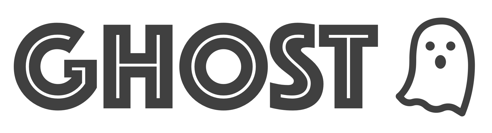

# GHOST - Flywheel gear ⚙️



## Usage on FlyWheel

Assumes that QA data is organized inside a project, each site is a subject, and scan sessions organized as sessions. The gear can be run on Project, Subject, or Session level. It will extract the container ID for the container it is executed from and then process all child containers from there. The data in each session must follow the structure outlined in the UNITY QA Paper. The gear assumes that data has been converted to **nifti+json** pairs before processing.

The processing follows these main steps:

1. Find all child nodes from the current container (down to session level)
2. Download the files to the container and organize in bids format.
3. Run `fw_process_subject` on each session. This will segment all the compartments of the phantom.
4. Upload the outputs in a custom analysis container associated with the session.

Consider running the gear on subject level since the container includes the nnUNet segmentation models and is thus fairly large (~15 Gb). Running in parallel for each session would introduce a large overhead in terms of data transfer.

Processing options:

- `nnUNetDevice`: `cpu/cuda/mps` (Default `cpu`). The GPU option (`cuda`) requires execution on node with cuda installed.
- `nnUNetQuick`: `true`/`false` (Default `false`). Uses the `--disable-tta` option for nnUNet for faster processing. Only to be used for debugging
- `runMimicSeg`: `true`/`false` (Default `true`). To run the T1/T2/ADC mimic segmentation.
- `runFiducialSeg`: `true`/`false` (Default `true`). To run the fiducial segmentation with nnUNet.

To process the stats for the segmentations there is a separate, more lightweight gear called [`fw-ghostStats`](https://github.com/UNITY-Physics/fw-ghostStats).

## Building container

Build the container using the new `fw` interface

```sh
fw-beta gear build
```

### Debugging container

First create a config file, this assumes you have your FW API key stored as environment variable.

```sh
fw-beta gear config --create
fw-beta gear config -i api-key=$FW_CLI_API_KEY
```

To run and debug the container, run it in interactive mode

```sh
fw-beta gear run -i -e bash
```

To execute the gear for a certain container you can provide the container ID as an input argument to the run script

```sh
python3 run.py container_id
```

To get the container ID you can use the fw api.

```python
fw = flywheel.Client()
proj = fw.projects.find_one('label=UNITY-QA')
sub = proj.subjects.find_one('label=<MY_ID>')
ses = sub.sessions.find_first() # Or find your desired one
```

Remember that you need to create the `work`/`input`/`output` directories in your local folder when running this on your local machine.

## Known bugs and improvements

- Can only process axial scans. The fiducial segmentation model does not work with the sagital or coronal scans for the moment.
- There is no check for if previous analysis exists. Will always re-run.
